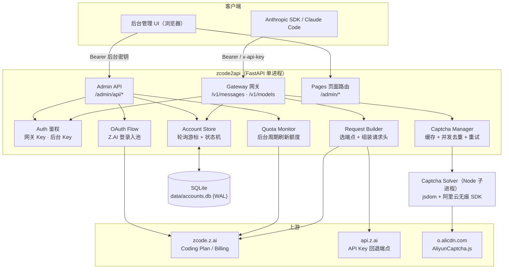
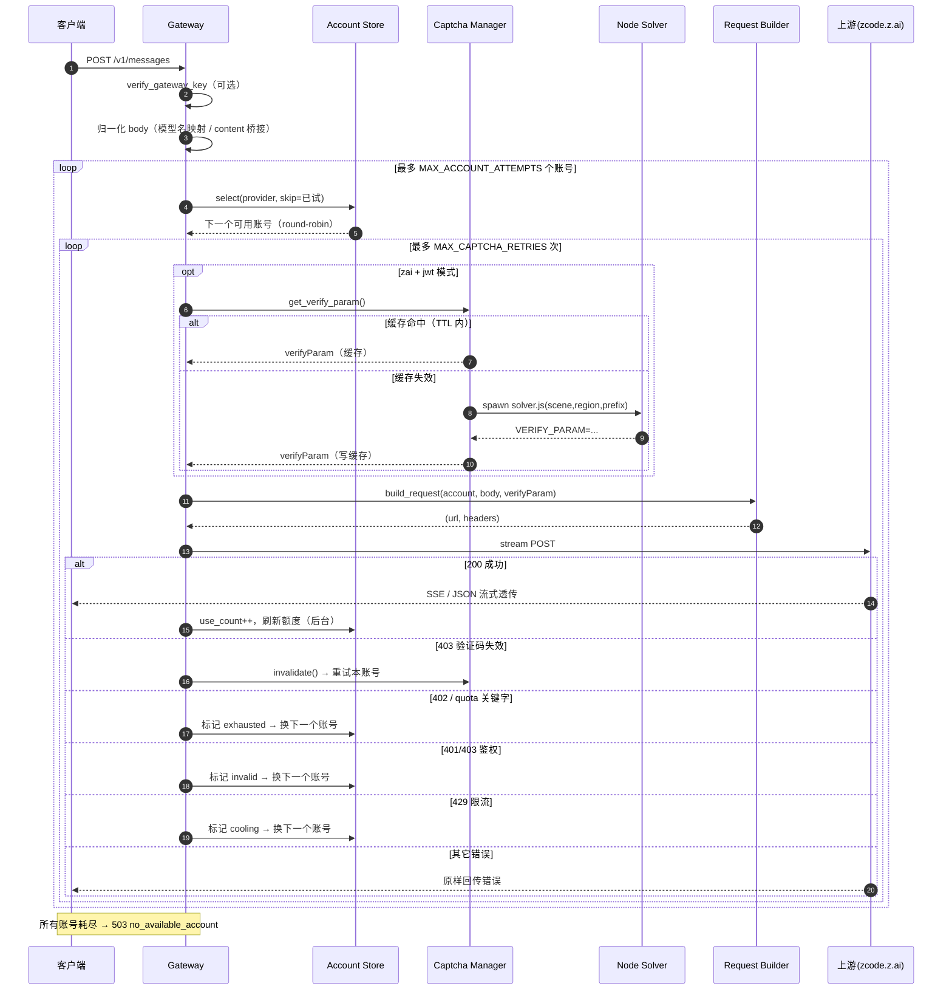
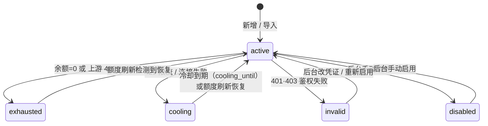
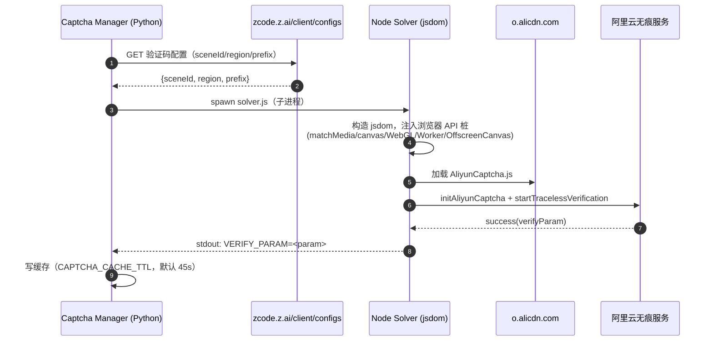

# 架构概览（Architecture）

本文件描述 **zcode2api** 的整体架构、核心组件、请求流程与关键设计决策。

> zcode2api 是一个网关:对外暴露标准 **Anthropic Messages API**(`/v1/messages`),
> 对内将请求转发到 **ZCode (zcode.z.ai) Coding Plan** 上游,并提供多账号轮询、
> 额度用完自动换号、实时用量监控、后台管理 UI 与鉴权,以及阿里云无痕验证自动续期。

---

## 1. 设计目标

| 目标 | 实现手段 |
|------|----------|
| 协议兼容 | 完整复刻 Anthropic `/v1/messages` 请求/响应(含 SSE 流式) |
| 高可用 | 多账号 round-robin;单账号失败/额度耗尽自动切换下一个 |
| 可观测 | 后台周期刷新各账号额度,UI 实时展示状态与剩余额度 |
| 无浏览器 | 用 Node + jsdom 在模拟浏览器环境跑阿里云无痕 SDK,**不启动真实浏览器** |
| 凭证安全 | 账号/密钥仅落本地 SQLite;前端鉴权,token 脱敏展示 |
| 轻量部署 | 单进程 FastAPI + 一个 Node 子进程;无外部数据库依赖 |

---

## 2. 系统架构图



**命名约定**:图中用组件的**职责名**(Gateway、Account Store、Captcha Manager……)而非文件名标识,
以避免歧义——例如代码里存在两个 `main.py`(根目录的 **CLI 入口** 与 `app/main.py` 的 **应用工厂**),
在架构层面分别对应 *CLI* 与 *App Factory* 两个角色。组件 ↔ 文件的映射见 §3。

---

## 3. 核心组件

| 组件(职责名) | 文件 | 职责 |
|--------------|------|------|
| App Factory | `app/main.py` | FastAPI 应用工厂 + 生命周期(启动监控、打印 banner、挂载路由/静态资源) |
| CLI | `main.py`(根) | 命令行入口:`serve` / `login` / `add-account` / `quota` / `export` … |
| Gateway 网关 | `app/routes/gateway.py` | `/v1/messages`(轮询+换号+验证码续期+SSE 透传)、`/v1/models` |
| Admin API | `app/routes/admin_api.py` | `/admin/api/*`:账号增删改、启用禁用、刷新额度、OAuth、设置、导入导出 |
| Pages | `app/routes/pages.py` | 后台页面(login / accounts / settings)与重定向 |
| Auth 鉴权 | `app/auth_admin.py` | `verify_admin_key`(后台)、`verify_gateway_key`(网关,可选) |
| Account Store | `app/store.py` | SQLite 持久化 + 内存账号表 + round-robin 游标 + 设置(meta) |
| Account Model | `app/models.py` | `Account` 数据类、`Status` 状态、可选中判定、脱敏视图 |
| Request Builder | `app/agent.py` | 按凭证选上游端点、组装请求头(含 `X-Aliyun-Captcha-Verify-Param`) |
| Quota Monitor | `app/quota.py` | 单账号额度查询 + 状态判定 + 后台周期刷新任务 |
| Captcha Manager | `app/captcha.py` | 拉取验证码配置、调用 Node 求解器、缓存/并发去重/重试 |
| Captcha Solver | `captcha_node/solver.js` | jsdom 模拟浏览器跑阿里云无痕 SDK,输出 `verifyParam` |
| OAuth Flow | `app/oauth.py` | Z.AI OAuth:init → poll → 兑换 API Key |
| Settings | `app/settings.py` | 环境变量 / 默认值 / 路径 / 上游端点 |
| Logs | `app/logs.py` | 彩色终端日志(banner / req / req_ok / req_err …) |

---

## 4. 请求处理流程:`POST /v1/messages`



关键常量(`app/routes/gateway.py`):`MAX_CAPTCHA_RETRIES = 3`、`MAX_ACCOUNT_ATTEMPTS = 5`。
流式透传使用 `httpx.stream` + `StreamingResponse`,读超时设为 `None` 以支持长连接 SSE。

---

## 5. 账号状态机



| 状态 | 是否参与轮询 | 触发 | 恢复 |
|------|:---:|------|------|
| `active` | ✅ | 默认 | — |
| `cooling` | ⏳ 冷却到期后 | 429 / 连接失败 | `cooling_until` 到点;或额度刷新 |
| `exhausted` | ❌ | 额度=0 / 402 / quota 关键字 | 额度刷新检测到剩余>0 |
| `invalid` | ❌ | 401/403 非验证码鉴权失败 | 改凭证 / 重新启用 |
| `disabled` | ❌ | 手动禁用 | 手动启用 |

可选中判定见 `Account.is_selectable()`;冷却到期的实时换算见 `effective_status()`。

### 轮询算法

`Store.select()` 每次从「可被选中」的账号里按游标取下一个,游标对每个 provider 独立维护:

```text
pool = [a for a in accounts[provider] if a.is_selectable(now) and a.id not in skip_ids]
idx  = rotation[provider] % len(pool)
rotation[provider] = (idx + 1) % len(pool)
return pool[idx]
```

`skip_ids` 保证同一次请求不会重复尝试已失败的账号。

---

## 6. 无浏览器无痕验证

Coding Plan(JWT)模式访问 `zcode.z.ai` 上游需携带阿里云无痕验证参数
(请求头 `X-Aliyun-Captcha-Verify-Param`)。本项目**不启动真实浏览器**,而是:



- `verifyParam` 实为 `base64(JSON{certifyId, sceneId, isSign, securityToken})`,由阿里云服务端签发。
- **缓存**:TTL 内复用;**并发去重**:同一时刻仅跑一个求解进程(`asyncio.Lock`);
  **重试**:`CAPTCHA_SOLVE_RETRIES`(默认 4)次。
- 仅 zai + JWT 账号需要;API Key 账号走 `api.z.ai` 回退端点,无需验证码。

---

## 7. 数据持久化

账号与设置存于项目本目录下的 `data/accounts.db`(SQLite,WAL 模式)。
运行期账号对象常驻内存(保证轮询游标与状态实时性),每次变更同步落库;进程启动时从库读取快照。

```text
accounts(  id PK, provider, name, mode, status, enabled, created_at, data JSON )
meta(      key PK, value )      # admin_key / gateway_key / quota_refresh_interval
```

`data` 列以 JSON 存放完整 `Account`(含额度快照、用量、计数器等),
便于演进字段而无需频繁迁移表结构(`Account.from_dict` 会忽略未知字段)。

---

## 8. 鉴权模型

| 范围 | 依赖 | 规则 |
|------|------|------|
| 后台 `/admin/api/*` | `verify_admin_key` | 必须 `Authorization: Bearer <后台密钥>`(或 `?app_key=` 供 EventSource);`hmac.compare_digest` 定时安全比较 |
| 网关 `/v1/messages`·`/v1/models` | `verify_gateway_key` | 配置了网关 Key 才校验(`Bearer` 或 `x-api-key`);留空放行 |

密钥存于 `meta` 表,可在「设置」页或 `.env` 初始化。前端凭证加密存于浏览器 localStorage。

---

## 9. 配置

所有可调参数集中在 `app/settings.py`,均可由环境变量覆盖(见 `README.md` 的环境变量表)。
要点:`ZCODE_PORT`、`ZCODE_DATA_DIR`、`ZCODE_QUOTA_REFRESH_INTERVAL`、`ZCODE_COOLING_SECONDS`、
`ZCODE_NODE_PATH`、`ZCODE_CAPTCHA_TIMEOUT`、`ZCODE_CAPTCHA_RETRIES`、`CAPTCHA_CACHE_TTL`。

---

## 10. 目录结构

```text
├── app/
│   ├── main.py            # App Factory：FastAPI 应用工厂 + 生命周期
│   ├── settings.py        # 配置
│   ├── models.py          # Account / Status
│   ├── store.py           # SQLite 持久化 + 轮询游标
│   ├── agent.py           # Request Builder
│   ├── captcha.py         # Captcha Manager
│   ├── quota.py           # Quota Monitor
│   ├── oauth.py           # OAuth Flow
│   ├── auth_admin.py      # 鉴权依赖
│   ├── logs.py            # 彩色日志
│   ├── routes/            # gateway / admin_api / pages
│   └── statics/           # css / js / admin/*.html
├── captcha_node/          # Captcha Solver（Node + jsdom，solver.js）
├── main.py                # CLI 入口
├── data/                  # 运行时生成：accounts.db
└── docs/ARCHITECTURE.md   # 本文件
```

---

## 11. 已知限制与未验证事项

> **说明**:由于作者**没有可长期使用的付费 Coding Plan 账号**,以下行为**未能充分实测验证**,
> 文档中的相关描述基于上游接口的观测与推断,可能与真实上游存在偏差。欢迎有条件的使用者反馈/纠正:

- **额度/计费字段**:`billing/current`、`billing/balance`、`usage` 的返回结构与字段含义(如
  `total_units` / `used_units` / `remaining_units` / `expires_at`)主要依据观测,不同套餐可能不一致。
- **额度用完判定**:`exhausted` 触发条件(余额=0、HTTP 402、错误体含 `quota/insufficient/余额` 等关键字)
  为启发式;真实上游的耗尽信号若不同,可能需要调整 `app/quota.py` / `app/routes/gateway.py` 的判定。
- **模型清单**:`/v1/models` 当前固定为 `GLM-5.2` 与 `GLM-5-Turbo`,未做上游动态拉取。
- **无痕验证 SDK**:`solver.js` 运行的是阿里云自家混淆 SDK;若其指纹逻辑(feilin / cloudauth-device)更新,
  jsdom 中补齐的浏览器 API 桩可能需要相应调整。
- **限流/冷却时长**:`COOLING_SECONDS` 为经验默认值,非上游明确约定。

如发现实际行为与本文档不符,请优先以真实上游为准,并通过 Issue/PR 帮助我们修正文档与判定逻辑。

---

## 12. 参与贡献

欢迎提交 **Issue** 反馈问题、提出需求,或直接发起 **Pull Request** 改进代码与文档:

- **提问题 / 报 Bug**：在仓库 [Issues](https://github.com/hechushitaoyuan/zca/issues) 中描述复现步骤、
  期望行为与实际行为(如涉及上游返回,请脱敏后附上结构,**切勿泄露你的 JWT / API Key**)。
- **提交 PR**:Fork → 新建分支 → 提交(遵循 `feat:` / `fix:` / `docs:` 等约定式提交)→ 发起 PR 并说明动机与测试方式。
- **改进方向举例**:额度字段的真实结构校正、上游模型动态拉取、更稳健的耗尽/限流判定、求解器健壮性、测试覆盖。

> 提交任何内容前,请确认未包含密钥、JWT、`data/accounts.db`、`.env` 等敏感信息。
